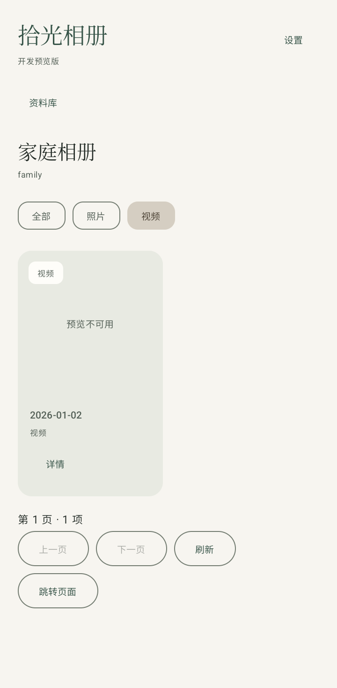
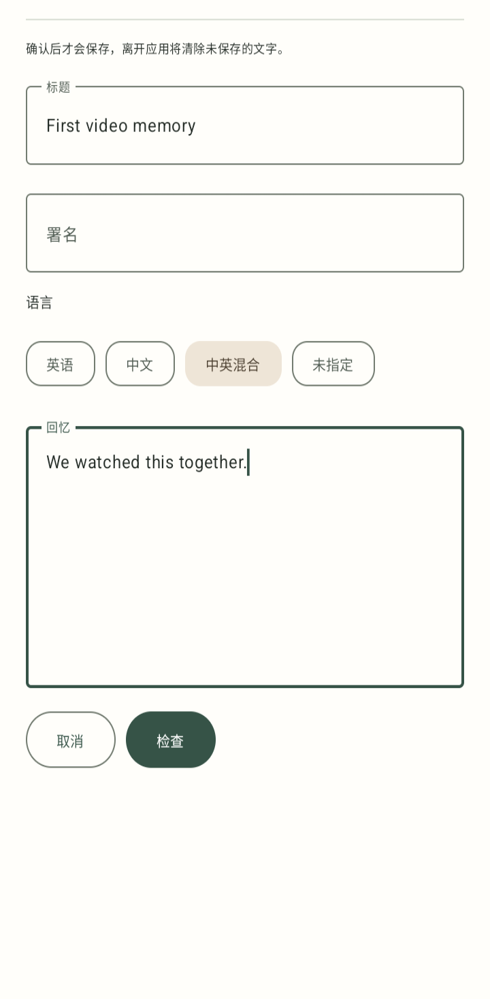
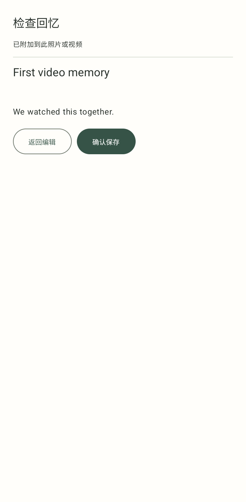
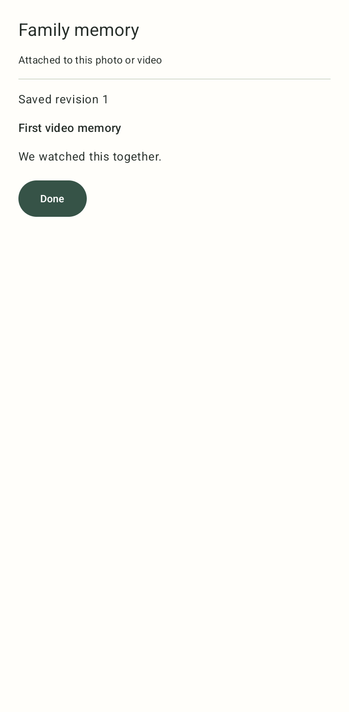

# Phone v15: videos, family memories and remembered sign-in

Date: 2026-09-20. Android base: `e7f8e0607a4a71796ff5998ecfd3f07901ee1b24`.
Worktree branch: `codex/phone-prepared-video-v13`.
The user accepted Phone v14 full-screen photo handling and photo transitions in
this session. That acceptance does not cover the v15 features below.

## Implemented

- Protected All / Photos / Videos chips use server filtering before count and
  pagination, preserving selection through pages, detail and return navigation.
  A new selection cancels obsolete page/thumbnail work. The original mixed-media
  request remains unchanged. The new build capability defaults off and requires
  a qualified candidate14 backend before enabling it in a family installation.
- Photo/video details expose Family stories, Add a memory and Edit memory using
  returned `can_create` / `can_edit`. Drafts support title, text, language and
  byline. Review freezes the request; Confirm saves once. Ambiguous failures keep
  the exact UUID/body for manual retry and respect Retry-After. Conflicts require
  reloading, reviewing the current server version and explicitly using its new
  revision with a new mutation UUID. The saved screen shows the actual returned
  server revision. Background/navigation/logout discard drafts and late results.
  Text memories remain separate from AI captions and anonymous Home/TV feeds.
- Optional remembered sign-in stores only the current Bearer token and issue/
  expiry times in an origin-bound AES-256-GCM AtomicFile under noBackupFilesDir.
  Android Keystore creates the key and randomized IV. Reads are bounded; corrupt,
  expired and invalid records fail closed. Cold start revalidates with the server
  behind the privacy cover. Logout/expiry clear storage. Passwords, account data,
  media and drafts are not persisted. Existing 24-hour expiry is unchanged; there
  is no invented refresh route or longer-lived session.

## Contract and backend

Backend source: `1ee1af8d6efb1fac0546bf9013ad4e044aa554e5`.
Backend pack: `4d1de0f06bae4f2e5342134db6a4b847657d2484`.
Profile: `2.0.0-candidate.14`, migration head `f2a6d8b4c915` unchanged.
78 real ASGI captures; all previous 70 unchanged. 116 source and seven payload
hashes verified, with the Android snapshot/pins updated together. Frozen mobile
v1 remains unchanged and its independent verifier passes.

## Verification

- 187 live-core JVM tests pass; 117 unchanged Home-core regression tests pass.
- Connected debug APK, instrumentation APK and Android lint pass using installed
  Gradle 8.10.2, JDK 17 and SDK/build-tools 34, offline dependency resolution.
- Connected privacy/source-boundary checks and both contract verifiers pass.
- Backend gallery/library/native-contract suites: 28 pass. The existing
  FastAPI/Starlette TestClient dependency emits one deprecation warning.
- Extracted immutable backend ZIP smoke passes: seven ASGI checks, 19 operator
  commands and nine disposable database-preparation operations; no listeners or
  live data. ZIP SHA-256:
  `16ffde933ac177c03f7a685152a6c05500946cb047514d2a5a9b198675e4a7f3`.
- Physical Android 16 phone, **separate synthetic QA package**: six tests pass
  (four Keystore tests; full video-filter/add/review/confirm/save/edit/background
  journeys in English and Chinese). Eight owned UI renders captured; selected
  renders below inspected. No real credentials or media used. QA packages were
  removed; the user's installed Phone v14 and data were preserved.
- Emulator API36 cold boot suffered Android system crashes before the test app
  started. Its attempted tests are not counted as pass. The owned emulator was
  stopped. Tablet and large-font v15 acceptance remain unverified.

## Delivery gates

Configured family APK/APK1 and backend source ZIP are kept in the private workspace
handoff, outside this public repository. V15 is not installed over the family app.
Deploy/revalidate candidate14 before enabling the new filtered gallery. Protected
prepared-video provider/index activation is still pending from the earlier playback
slice; a Videos filter does not make those playback bytes available. Preserve the
captioning workers and current live data during that separate rollout.

Written memories are implemented. Audio recording/transcription, spoken dubbing,
AI-caption editing and longer-lived refreshed sessions are separate features.
No push, merge, Windows deployment, service restart or live-database change was
performed for this slice. Physical tests of synthetic components are distinct from
real authenticated family acceptance after rollout.
