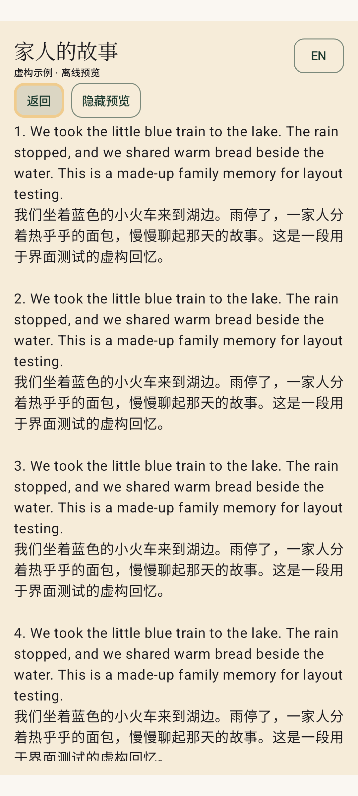
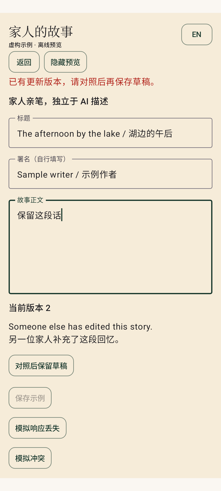
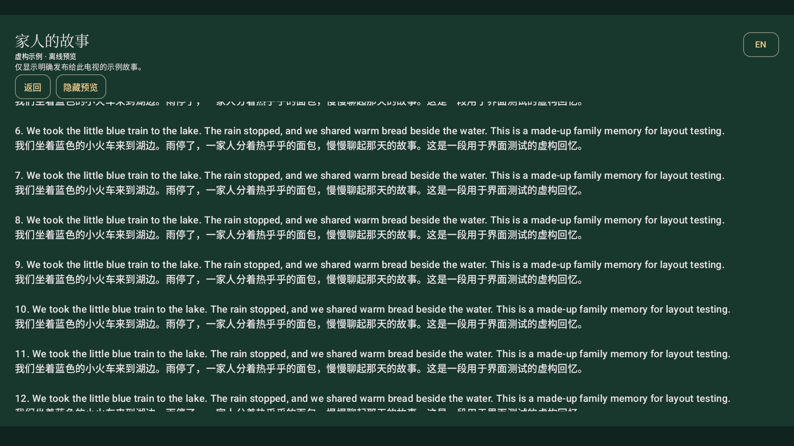

# Family Stories synthetic Android return

Workspace: `/Users/yanbo/Projects/mobileAppForPhotoHouse-home-search-v16`, branch `codex/home-search-parity-v16`, base `1185327f7cfbae13eabfe0781a602b7c5e27a265`.

This is an opt-in local prototype, separate from the previously delivered calendar TV v18 / Phone Home v9 release. No Stories APK was distributed, and no story network request, backend mutation, Windows/GPU action or physical device installation occurred. Existing release version numbers and private APKs were preserved.

## Changes

- Shared phone/TV fixture presentation: literal full EN/ZH stories, separate family/legacy/AI source labels, local sample search and media filters, long text, empty results and warm cream/green styling.
- In-memory viewer, own-contributor, other-contributor and owner capability scenarios; draft validation by UTF-8 bytes; stable UUID/body after uncertain saves; explicit conflict comparison/rebase; discard warning; current-version result labels; background/access/library/publication invalidation.
- TV includes only explicitly marked synthetic published entries, with no write controls. Native remote focus, read scrolling and Back are independent checks. This is not a production publication policy.
- New `story-fixture-core` plus a shared UI source directory. Both app builds require `photohouseStoryFixtureEnabled=true` to compile the non-exported debug lab activity and its synthetic content. Default/public verification forces false and checks DEX content for absence. There is no launcher or production navigation entry.
- [Adoption proposal](../../../../android/STORIES_FIXTURE.md), including a proposal-only manifest with six producer file hashes at backend source `97e9cc4eaa2c0ff34aa60837e84099c017927ef1`. No frozen contracts or transport DTOs were edited/adopted. API review evidence HEAD is `2ad064fb845fc077bb4ecfdb38494023022e3c0a`.

## Evidence

- 16 JVM cases passed; both opt-in debug/instrumentation builds and phone/TV lint passed. Frozen verifier: 12 operations, 38 retained ASGI cases and eight checksummed files passed. This invocation validates the shared stored contract; it does not replay the new story API.
- Existing `Medium_Phone_API_36.0`, serial `emulator-5554`, qemu=1, Android API 36. Standard development/debug signing only, expressly clarified by the coordinator for this local test slice. No production signing assets used.
- Phone at 1080×2400 / density 420: five scenarios passed in the repaired six-case run; its remaining discard regression then passed in a focused final run (79.941 s). Coverage includes source/media search, long literal text, uncertain retry, conflict/discard, access loss and background clearing; the common TV-style read/focus test also passed in the phone run. Do not describe that intermediate six-case run as wholly green.
- The first UI run exposed a clipped horizontal test-control row, a clipped-bounds scroll assertion, and keyboard/window-focus assumptions in native Back injection. Controls now stack on phone; the test checks actual scroll offset and waits for IME dismissal/activity focus. A further core regression ensures typing after a conflict cannot skip revision review. Relevant checks were rerun after repair.
- Chinese long-reading and conflict comparison screenshots were inspected. Screenshot/test artifacts contain synthetic text only. Landscape TV at 1920×1080 / density 240 passed its native Center/Up/Down/Back and publication-withdrawal scenario in 19.709 s. The screenshot was inspected. Both ordinary-build APKs rebuilt successfully and their DEX content contained no story-lab classes. Display overrides were restored to 1080×2400 / density 420 before stopping the emulator.

Raw local logs: `/tmp/story-fixture-verified-build.log`, `/tmp/story-fixture-phone-ui-final.log`, `/tmp/story-fixture-phone-conflict-final.log`, `/tmp/story-fixture-tv-landscape.log`, `/tmp/story-fixture-excluded-build.log`. Debug test APKs were retained temporarily under `/tmp/photohouse-story-fixture-artifacts/`; the checked hashes are in `artifacts.json`. Build-output APKs may later be replaced by the ordinary-build exclusion check; they are not the delivered Home release files.

## Next gates

Coordinator must adopt the additive source-pinned native snapshot and wire vectors before Android builds a bounded 3 MiB story response reader or enables protected phone read/search. Production search must use server asset grouping/ranking; this local lab filters sample story cards. Server pagination/history/removal and integrated media-detail navigation are outside this slice. Offset pages are not snapshots; exact retries may return newer current content.

TV requires a separately reviewed approved-story projection with audience/catalog/publication/withdrawal binding. Private story routes cannot enter the anonymous Home feed. Release signing/distribution, real networking and physical phone/projector acceptance remain separate gates. No new push or merge is part of this handoff.

## Inspected synthetic screens

