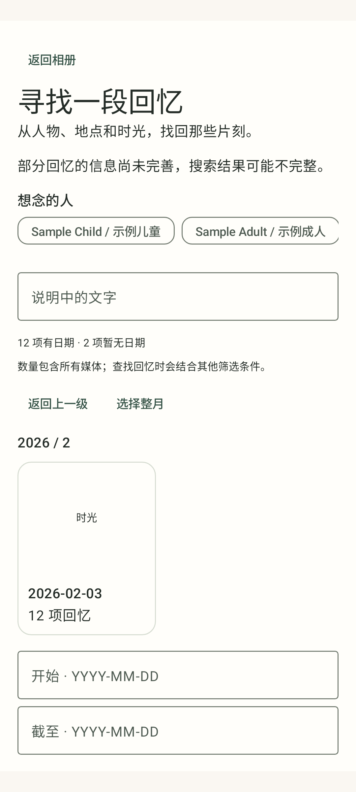

# Home calendar — TV v18 and Phone Home v9

Base ddb30d63c70b9a7724e8435a55a32b8c4f206913, branch codex/home-search-parity-v16.
Adds visual year/month/day selection with counts, existing-media cover thumbnails,
back/whole-period selection and bounded year pagination. Selecting dates preserves
other draft filters until Apply. Existing server-provided family shortcuts and
multi-person filters consume the reviewed people export without hardcoded identities.

The independent calendar contract pins backend 76f7a58 (full SHA in its manifest)
and 54 producer inputs. Older contract packs remain unchanged. Calendar is opt-in
at build/launcher time and disabled in public verification. Both TV constructor
paths and phone Home mode use the explicit flag; protected phone access stays separate.

Validation with the existing JDK17, Gradle8.10.2 and SDK34:
- 244 JVM tests passed: core22, protected103, Home117, TV2.
- Both APKs and instrumentation APKs built; phone/TV lint and all contract/boundary
  verifiers passed. Backend blobs and working bytes matched the independent pin.
- API36 emulator: five phone discovery tests and seven TV discovery tests passed.
  Includes year → month → day, retaining a person filter through Apply, native TV
  D-pad focus/Center, stale metadata, leap years and exact producer cover transport.
- Chinese calendar screenshots were inspected. The UI fixture intentionally uses a
  missing-cover card; missing covers preserve bucket selection/counts. Real cover
  transport is tested separately with exact producer media and native qualification.

No physical-device installation or playback acceptance is implied. Publication of
real family shortcuts requires the separately prepared roster/assignment approval;
source tests and manual-label counts do not approve that private proposal.
