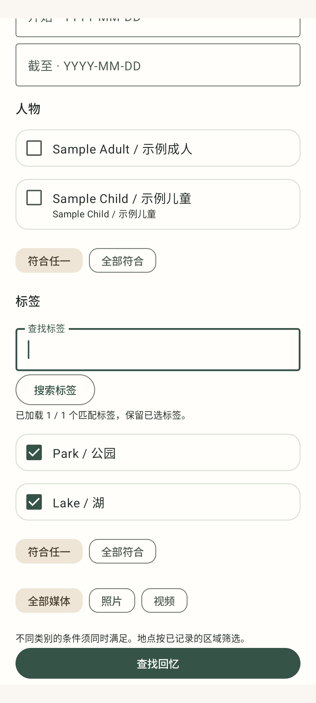
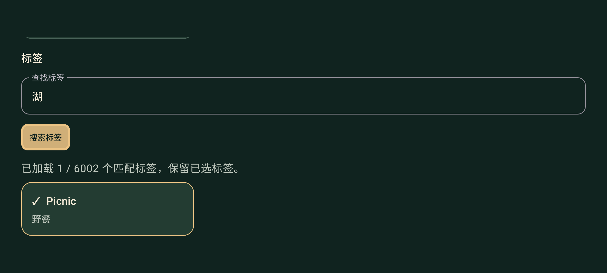

# Home tag lookup — TV v17 and Phone Home v8

Base 013dccb6865b26e96e5f41cff8a289fb09a98a8a, branch codex/home-search-parity-v16.
Both Home clients now support explicit tag-name lookup, bounded pages, retained
selections across queries, and combined any/all tag filters. This is the shared
Home mode; protected phone access retains its own transport and contract.

The new independent tag-discovery contract pins backend
52c3bac16c85d3b0f40d29cfa10c2e473756cfe1 and 47 producer inputs together. Its exact
synthetic responses are replayed through the TLS JVM adapter. Existing v1/v2 packs
remain frozen. Private Home configuration is supplied only at build time. Tag
lookup defaults off and public verification explicitly disables it.

Checks completed with JDK 17, installed Gradle 8.10.2 and Android SDK 34:
- 239 JVM tests passed: fixture core22, protected103, Home112, TV2.
- Both debug APKs and Android test APKs built; connected/TV lint passed.
- All contract and platform boundary verifiers passed; new producer source blobs
  and working bytes matched the backend pin.
- Medium Phone API36 emulator: seven phone Home tests and six TV discovery tests
  passed. TV rendered landscape and used native D-pad Center for tag lookup.
- Chinese phone and TV screenshots were inspected: readable labels, selected-tag
  state and focused TV action. Synthetic callbacks do not prove live projector use.

Runtime and delivery receipts remain private. Real family-device validation,
reviewed person assignments/aliases, coarse regions and theme/topic taxonomy are
separate outstanding steps. No new audience, credentials or biometric inference.
